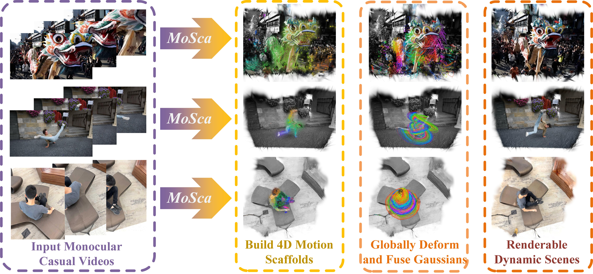
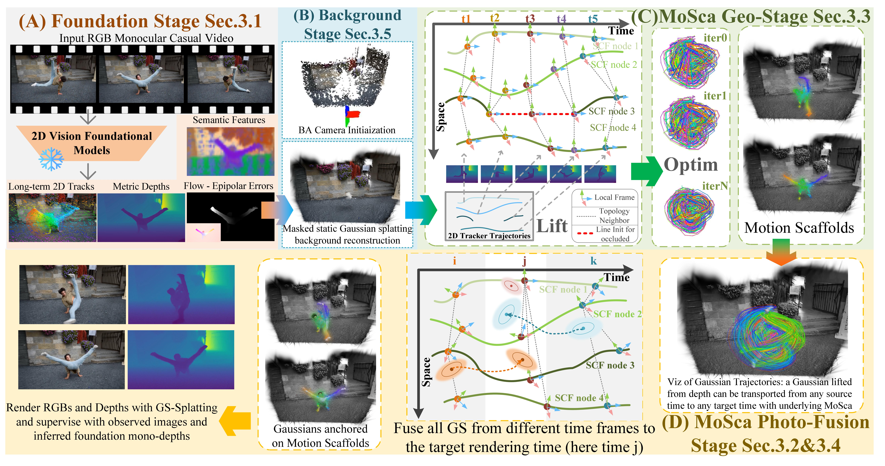

# MoSca: Dynamic Gaussian Fusion from Casual Videos via 4D Motion Scaffolds

[Project Page](https://www.cis.upenn.edu/~leijh/projects/mosca/) | [Video](https://www.youtube.com/watch?v=to869D5V7gQ&t=1s)

**The code will be released no later than the acceptance of the paper.**

